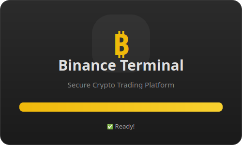
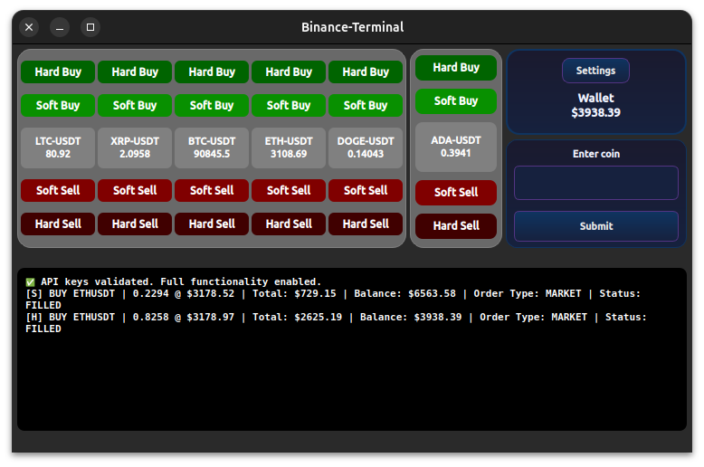
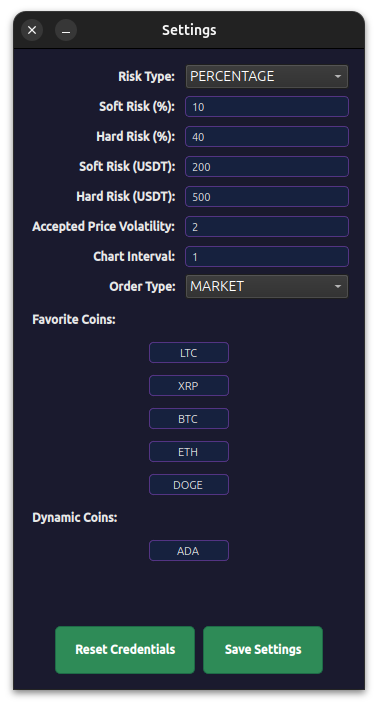

# Binance Terminal

A professional trading application for Binance cryptocurrency exchange with real-time price monitoring and automated trading capabilities.

## Features

- Real-time price monitoring via WebSocket
- Favorite coins management
- Automated trading with risk management
- Interactive candlestick charts
- User preferences configuration
- Professional GUI built with PySide6

## 📸 Application Tour

Here's a visual tour of the Binance Terminal features:

### 1. Secure Entry & Initialization
The application starts with a sleek splash screen while initializing secure connections, followed by a local authentication requirement.

<p align="center">
  
  
</p>

### 2. Main Dashboard
The command center for your trading. It features real-time price monitoring, interactive charts, and direct access to your favorite trading pairs.

<p align="center">
  
</p>

### 3. Configuration & Preferences
Fully customizable experience. Adjust your risk management settings, UI preferences, and API connections directly from the settings panel.

<p align="center">
  
</p>

## ⚠️ Important Financial Disclaimer

**WARNING: This is a financial trading application that involves real money and cryptocurrency trading.**

- **USE AT YOUR OWN RISK**: Trading cryptocurrencies carries substantial risk of loss and is not suitable for all investors.
- **NO LIABILITY**: The developer(s) of this application are NOT responsible for any financial losses, damages, or consequences resulting from the use of this software.
- **NOT FINANCIAL ADVICE**: This application is a tool only and does not provide financial advice. All trading decisions are your own responsibility.
- **EDUCATIONAL PURPOSE**: This software is provided for educational and informational purposes only.
- **API RISKS**: Using exchange APIs with real accounts involves risks including but not limited to: technical failures, network issues, API changes, and security vulnerabilities.

By using this application, you acknowledge and accept full responsibility for all trading activities and potential losses.

## 🔒 Privacy & Data Security Disclaimer

**IMPORTANT: This application operates entirely on your local machine.**

- **LOCAL OPERATION**: This application runs completely locally on your computer and does NOT send any data to external servers owned or controlled by the developer.
- **NO DATA COLLECTION**: The developer does NOT collect, store, or have access to your API keys, trading data, or any personal information.
- **NO REMOTE SERVERS**: Your sensitive information (API credentials, trading history, portfolio data) remains solely on your local machine.
- **THIRD-PARTY CONNECTIONS**: This application only connects directly to official Binance APIs - no intermediary servers are used.
- **USER RESPONSIBILITY**: You are solely responsible for securing your local environment, API keys, and any data stored by this application.
- **NO LIABILITY FOR DATA BREACHES**: The developer is NOT responsible for any data theft, security breaches, or unauthorized access that may occur on your local system or through Binance's services.

**Security Best Practices:**

- Keep your API keys secure and never share them
- **CRITICAL**: When creating Binance API keys, NEVER enable "Enable Withdrawals" or "Enable Transfers" permissions
- **RECOMMENDED**: Only enable "Enable Spot & Margin Trading" and DISABLE "Enable Futures" for safety
- **USE SPOT TRADING ONLY**: Avoid margin and futures trading as they involve higher risks and potential for greater losses
- Use API keys with minimal required permissions only
- Ensure your local system is secure and up-to-date
- Regularly backup your configuration and trading data
- **TRADING RESPONSIBILITY**: All trading decisions and their consequences are entirely your responsibility

## Installation

1. Clone the repository:

```bash
git clone https://github.com/AhmetNA/Binance_Terminal.git
cd Binance_Terminal
```

2. Install dependencies:

```bash
# Install main dependencies
pip install -e .

# For development (includes testing, linting tools)
pip install -e .[dev]

# For building executable
pip install -e .[build]
```

3. Set up your API credentials:

```bash
cp config/.env.example config/.env
# Edit config/.env with your Binance API credentials
```

4. Run the application:

```bash
python src/main.py
```

## Configuration

Edit `config/preferences.txt` to customize:

- Risk percentages for trading
- Favorite coins list
- Chart intervals
- Price volatility settings

## Project Structure

```
binance_terminal/
├── assets
│   └── btc.png
├── config
│   ├── .env.example
│   ├── fav_coins.json.backup
│   ├── .gitignore
│   ├── preferences.example.txt
│   └── Preferences.txt
├── data
│   ├── analytics
│   ├── portfolio
│   └── trades
├── docs
│   └── CONTRIBUTING.md

├── scripts
│   ├── build.bat
│   └── build_exe.py
├── src
│   ├── api
│   │   ├── http_client.py
│   │   └── __init__.py
│   ├── config
│   │   ├── constants
│   │   │   └── trading.py
│   │   ├── __init__.py
│   │   ├── preferences_manager.py
│   │   └── preferences_service.py
│   ├── core
│   │   ├── globals.py
│   │   ├── __init__.py
│   │   ├── logger.py
│   │   ├── paths.py
│   │   └── trading_operations.py
│   ├── data
│   │   ├── analytics_service.py
│   │   ├── data_manager.py
│   │   └── __init__.py
│   ├── models
│   │   ├── __init__.py
│   │   └── order_types.py
│   ├── services
│   │   ├── account
│   │   │   ├── account_service.py
│   │   │   ├── __init__.py
│   │   │   └── wallet_service.py
│   │   ├── client
│   │   │   ├── client_service.py
│   │   │   └── __init__.py
│   │   ├── market
│   │   │   ├── __init__.py
│   │   │   └── live_price_service.py
│   │   ├── orders
│   │   │   ├── __init__.py
│   │   │   ├── limit_order_service_backup.py
│   │   │   ├── limit_order_service.py
│   │   │   ├── market_order_service.py
│   │   │   ├── order_service.py
│   │   │   └── order_type_manager.py
│   │   └── __init__.py
│   ├── ui
│   │   ├── components
│   │   │   ├── base_component.py
│   │   │   ├── chart_widget.py
│   │   │   ├── coin_entry_panel.py
│   │   │   ├── dynamic_coin_panel.py
│   │   │   ├── favorite_coins_panel.py
│   │   │   ├── __init__.py
│   │   │   ├── splash_screen.py
│   │   │   ├── terminal_widget.py
│   │   │   └── wallet_panel.py
│   │   ├── dialogs
│   │   │   ├── api_credentials_dialog.py
│   │   │   ├── __init__.py
│   │   │   ├── master_password_dialog.py
│   │   │   ├── security_dialogs.py
│   │   │   └── settings_dialog.py
│   │   ├── styles
│   │   │   ├── button_styles.py
│   │   │   ├── __init__.py
│   │   │   └── panel_styles.py
│   │   ├── __init__.py
│   │   └── main_window.py
│   ├── utils
│   │   ├── data
│   │   │   ├── config_manager.py
│   │   │   ├── favorites_manager.py
│   │   │   ├── file_operations.py
│   │   │   └── __init__.py
│   │   ├── security
│   │   │   ├── encryption_manager.py
│   │   │   ├── __init__.py
│   │   │   └── secure_storage.py
│   │   ├── symbols
│   │   │   ├── formatting.py
│   │   │   ├── __init__.py
│   │   │   ├── processing.py
│   │   │   └── validation.py
│   │   ├── trading
│   │   │   ├── __init__.py
│   │   │   ├── price_operations.py
│   │   │   ├── quantity_calculations.py
│   │   │   └── symbol_validation.py
│   │   ├── data_utils.py
│   │   ├── __init__.py
│   │   ├── math_utils.py
│   │   └── order_utils.py
│   ├── __init__.py
│   └── main.py
├── tests
│   ├── integration
│   │   ├── __init__.py
│   │   └── test_end_to_end.py
│   ├── unit
│   │   ├── test_client_service.py
│   │   ├── test_data_management.py
│   │   ├── test_order_service.py
│   │   ├── test_price_service.py
│   │   └── test_trade_execution.py
│   ├── conftest.py
│   ├── __init__.py
│   └── test_smoke.py
├── .gitattributes
├── .gitignore
├── LICENSE
├── pyproject.toml
├── README.md
├── requirements-dev.txt
├── requirements.txt
└── run_app.bat
```

## Development

See [CONTRIBUTING.md](docs/CONTRIBUTING.md) for development guidelines.

## License

This project is licensed under the MIT License - see the [LICENSE](LICENSE) file for details.

## Disclaimer

This software is for educational purposes only. Use at your own risk. The authors are not responsible for any financial losses.
